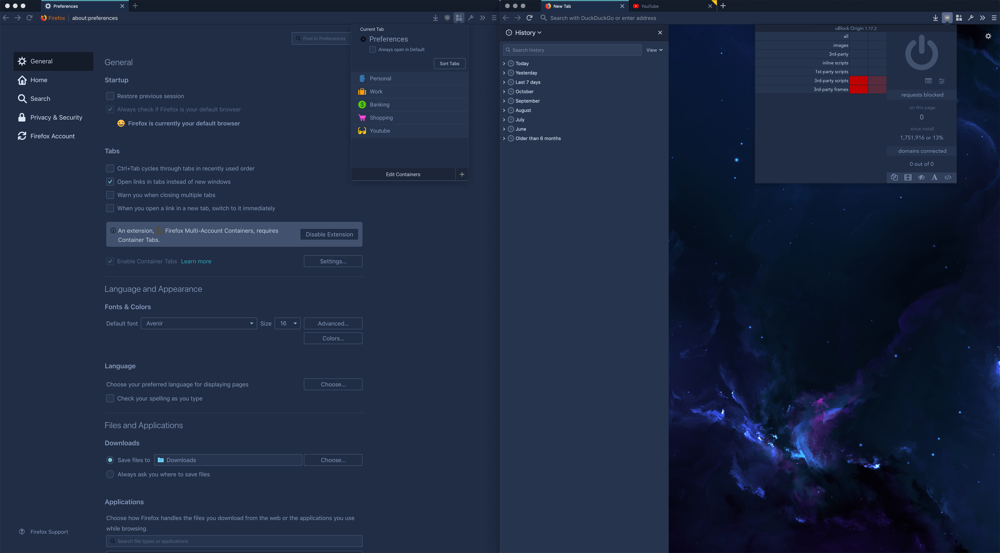
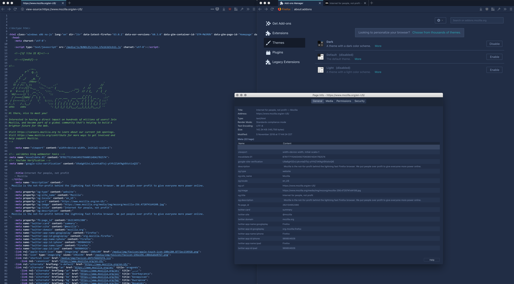
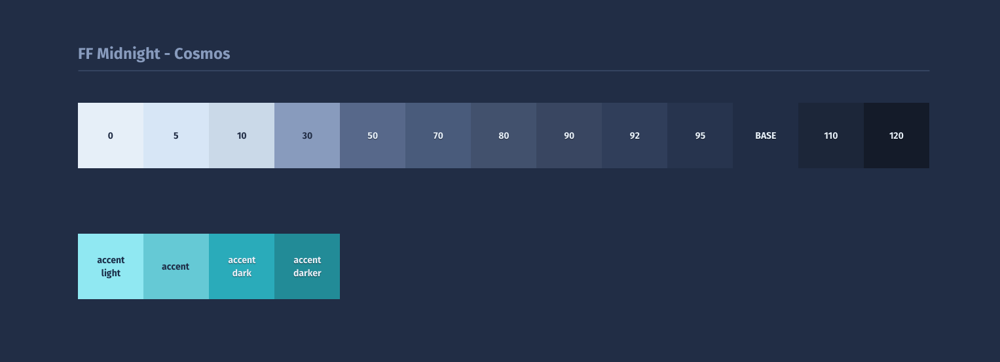
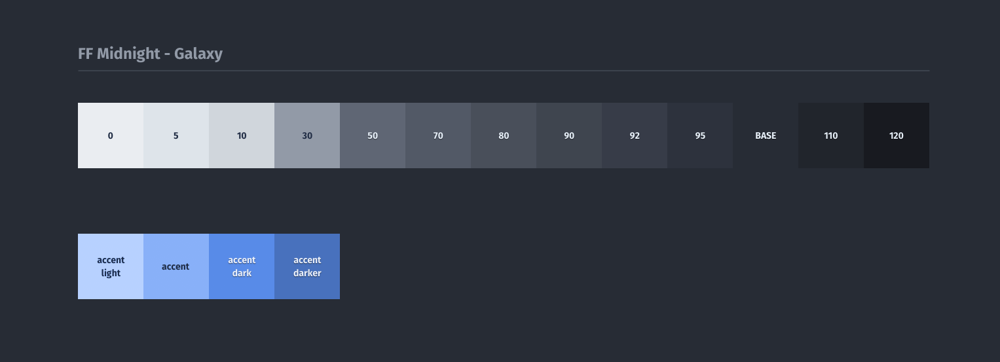
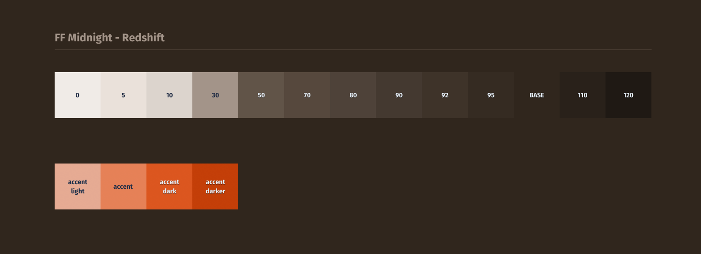

# 🌚 FF Midnight - A Dark Theme for Firefox

FF Midnight is a comprehensive dark theme system for Mozilla Firefox. It features interface styling that goes beyond the default built-in dark theme of the browser.

FF Midnight styles the complete interface in a dark color scheme, including Sidebars, Preference pages, View source page, PDF Viewer, all Firefox About:Pages and it also features a dark theme for popular addons such as uBlock Origin and Multi-Account Containers.

## 🎨 Theme color options

FF Midnight has 3 different dark color schemes that you can choose from:

- **Galaxy** - A dark blue-gray theme (default)
- **Cosmos** - A dark blue theme
- **Redshift** - A dark brown theme

Adding your own color scheme is easy. Use one the existing color scheme files as a starting point and change the colors.

## ⚙️ Installation

As a prerequisite you should use the default Firefox dark theme. It can be selected on the `about:addons#themes` page.

1. Find your Profile folder (Profile folder names are different for everyone):  
Go to the URL `about:support` > Profile Folder > Show in Finder (MacOS) or Open folder (Windows).  
Alternatively go to `about:profiles` > Root Directory > Show in Finder (MacOS) or Open Folder (Windows).
2. Copy the contents of this repository's `theme` folder to the `chrome` folder in your Profile folder. Create the `chrome` folder in your Profile folder if there is none yet.  
3. Optional: To change the default **Galaxy** color scheme to **Cosmos** or **Redshift** open `userChrome.css` and `userContent.css` and follow the instructions in there. 
4. Optional: If you have the uBlock Origin and/or Multi-Account Containers extensions installed you can add theme styling to their interfaces as well.  
 Go to `about:debugging#addons` and find and copy the UUID of these addons. Open the CSS files for these addons located in `theme\css\ff-midnight\extensions` and paste the UUID in the correct location (Instructions found in the css file).
5. Optional: Add a custom background image for the About:Home and About:Newtab pages: Open `background-image.css` and follow the instructions in there. 
6. Restart the browser.

## 🌌 Preview

> Preferences page, Sidebar, Custom background for About:Newtab, Custom Tab indicators, uBlock Origin and Multi-Account Containers panels

> View Source page, About:Addons page, Page Info dialog window

## 👯‍♀️ Contributions

This theme is tested on MacOS but it should work fine on Windows and Linux. If you find any bugs or have suggestions all feedback is welcome.
